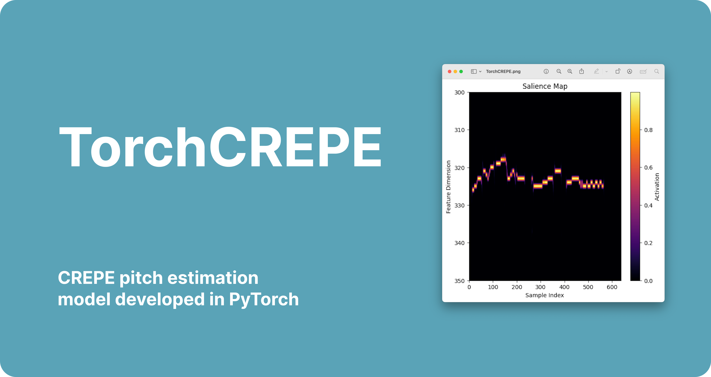

<div align="center">
  
</div>

<h3 align="center">
  <b><a href="https://torch-crepe-demo.chloelavrat.com">Interactive Demo</a></b>
  •
  <b><a href="https://www.youtube.com">Video</a></b>
  •
  <b><a href="">Python API</a></b>
</h3>

<div align="center">
  <a href="https://opensource.org/licenses/MIT">
    
  </a>
  
  
</div>

<p align="center">The <b>Torch-CREPE</b> project re-develop the CREPE pitch estimation model in PyTorch, empowering its optimization and adaptation for real-time voice pitch detection tasks. By re-developping this deep learning-based system, we unlock new research possibilities for music signal processing and audio analysis applications.</p>

## How it Works

The **PyTorch CREPE** implementation utilizes the **Torch** and **Torchaudio** library to process and analyze audio signals. The project's core functionality is based on the CREPE model, which estimates fundamental frequencies from audio data. 

The way this model achieve this is by doing a classification of 20ms audio chunks on 350 classes representing the audio range in cents of the observed fundamental frequency.

## Features

- **Real-time pitch detection:** Processing done in realtime using the given script. 
- **Optimized for instrument and voices:** Trained on instruments and voices for maximum usescases focuses.
- **Deep learning-based**: system with full PyTorch implementation
- **Fast Integration** with Torchaudio library
- **Trainable on Consumer GPU** (complete train done on an RTX-3080)

## Run app locally

To run the PyTorch CREPE demo locally, you can use the following Python code:

```py
import torchaudio
from crepe.model import crepe
from crepe.utils import load_test_file

crepe = crepe(model_capacity="tiny", device='cpu')

audio, sr = load_test_file()

time, frequency, confidence, activation = crepe.predict(
    audio=audio,
    sr = sr
)
```

## Python API

For a detailed documentation of the PyTorch CREPE implementation, including the API and usage guidelines, please refer to [this link].

## Datasets

[MIR-1K](http://mirlab.org/dataset/public/MIR-1K.zip)

## Contributing

This project is an open-source project, and contributions are always welcome. If you would like to contribute to the project, you can do so by submitting a pull request or by creating an issue on the project's GitHub page.

## License

This project is licensed under the MIT License. See the [LICENSE](LICENSE) file for details.
